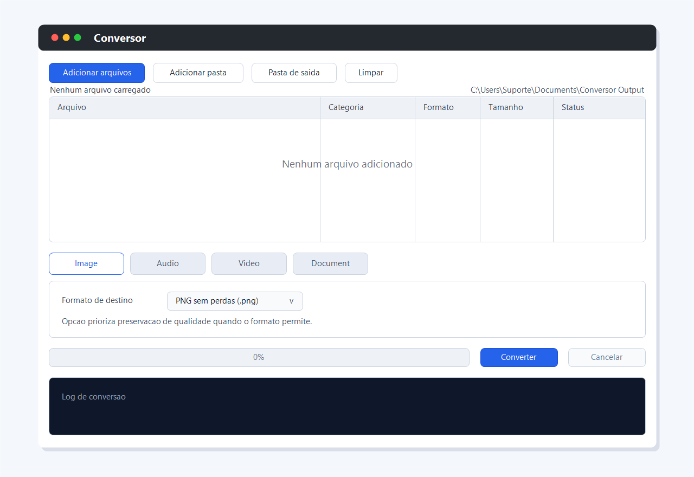
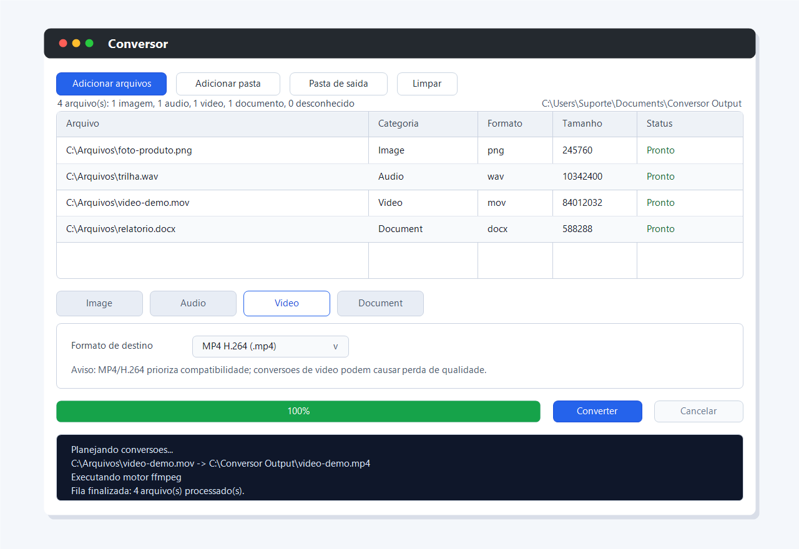

# Conversor

Conversor é um aplicativo desktop para converter arquivos localmente, com foco em privacidade, conversões em lote e escolhas seguras de qualidade.

O programa foi pensado para Windows, Linux e macOS usando uma interface nativa em Qt/C++. Os arquivos são processados no próprio computador; nada é enviado para serviços externos.

## Baixar o programa

Se você só quer usar o Conversor, baixe o executável do seu sistema:

| Sistema | Download direto |
| --- | --- |
| Windows | [Baixar instalador para Windows](https://github.com/leonfagundes/Conversor-/releases/latest/download/Conversor-Windows-x64.msi) |
| Linux | [Baixar AppImage para Linux](https://github.com/leonfagundes/Conversor-/releases/latest/download/Conversor-Linux-x86_64.AppImage) |
| macOS | [Baixar DMG para macOS](https://github.com/leonfagundes/Conversor-/releases/latest/download/Conversor-macOS-universal.dmg) |
| Todos os downloads | [Abrir página de releases](https://github.com/leonfagundes/Conversor-/releases) |

Para esses links diretos funcionarem, publique uma release no GitHub com estes nomes de arquivo:

- `Conversor-Windows-x64.msi`
- `Conversor-Linux-x86_64.AppImage`
- `Conversor-macOS-universal.dmg`

Depois de baixar, abra o arquivo e siga o fluxo normal do seu sistema operacional.

## Imagens do programa

### Tela principal



### Fila de conversão



## O que o Conversor faz

- Converte arquivos de áudio, vídeo, imagem e documentos.
- Permite adicionar arquivos avulsos ou pastas inteiras.
- Organiza a conversão por categoria de arquivo.
- Prioriza formatos que preservam qualidade quando isso é possível.
- Mostra avisos quando o formato escolhido pode causar perda de qualidade.
- Segue o tema claro/escuro do sistema quando ele é detectado e permite escolher o tema dentro do programa.
- Procura motores empacotados junto do aplicativo antes de usar programas disponíveis no `PATH`.

## Estado atual do projeto

Este repositório contém a primeira base do projeto:

- Núcleo em C++ puro para detectar categorias, listar formatos de destino e planejar conversões.
- Testes automatizados do núcleo com CTest.
- Interface desktop em Qt Widgets com tabela de arquivos, abas por categoria, opções de saída, avisos, progresso e log.
- Montadores de comandos para FFmpeg, ImageMagick, LibreOffice e Pandoc.
- Notas de empacotamento para Windows, Linux e macOS.

## Requisitos para desenvolvimento

- CMake 3.24 ou mais recente
- Compilador com suporte a C++20
- Qt 6 Widgets para compilar o aplicativo desktop

O núcleo e os testes não dependem de Qt. Se o Qt 6 Widgets não estiver instalado, o CMake ainda compila o núcleo e os testes, mas ignora o executável desktop.

## Compilar localmente

```powershell
cmake -S . -B build
cmake --build build
ctest --test-dir build --output-on-failure
```

## Estrutura do projeto

```text
src/core/      Lógica de planejamento de conversão em C++ puro
src/app/       Interface desktop em Qt Widgets
tests/         Testes do núcleo
docs/          Documentação do produto e da arquitetura
packaging/     Notas de empacotamento por plataforma
```

## Privacidade

O Conversor foi projetado para funcionar 100% localmente. Os motores de conversão devem ser empacotados junto de cada build, e o aplicativo não precisa de internet para processar arquivos.
